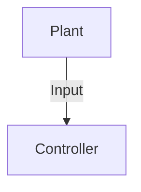

Sections:
- Introductions
    - Why we do a dev challege
    - The process
- How does PCM (And much of the auto industry) do software this way
- What is the goal of the PCM dev challenge this year
    - Controls
    - Requirements
    - Testing
    - Process
    - Documentation
- Extra Credit
    - Keeping groups of a similar year, otherwise it can often end up with a younger member not being able to contribute much and subsequntly not making the team
    - Smaller teams
    - Git (Provide a link to some resources that cover good practice) - It's ok if you don't exactly follow this, as long as valid justification is provided, not just "It was easier" or "I couldn't figure it out"
- Closing remarks
    - PLEASE PLEASE PLEASE ask for help, that's how we function here at McMaster EcoCAR, and that's how this challenge will be run. If it is something that we want to see you solve on your own, we will let you know, just don't be afraid to ask. Someone who figures something out by obtaining help will do better than someone who gets stuck.
        - P.S. If we feel a peice of information you ask for would give an unfair advantage, we will not provide it.

# Introduction
Hello and welcome to the PCM development challenge, here you will be tasked with implementing a control system in a group of 1-3 people. You will be provided with a model of a system to control (the plant) and a set of requirements to implement within MATLAB Simulink. The goal of this challenge is to give you a taste of what it is like to work on PCM, and to give you an opportunity to learn about the software development process.

### Controls 101
For those of you who are not familiar with controls, here is a brief overview of what controls are and how they work. A control system is a system that manages, commands, directs, or regulates the behavior of other devices or systems. In this challenge, you will be implementing a control system that will take in inputs from the plant and output commands to control the plant's behavior. A "Plant" can be many things, such as a motor, a vehicle, or even a process in a factory. The plant is the system that you are trying to control.

lol

